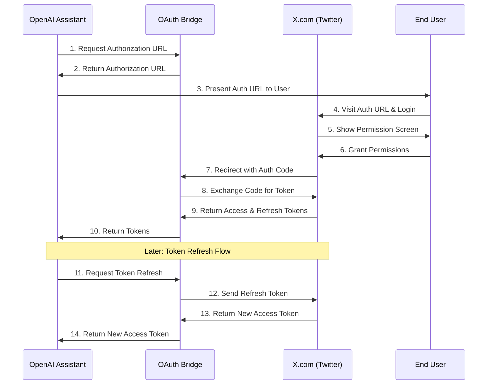

# X.com OAuth Bridge for GPT Assistants

A lightweight Flask server that handles OAuth 2.0 authentication flow between X.com (formerly Twitter) and OpenAI GPT assistants. This bridge simplifies the process of obtaining and refreshing access tokens for X.com API integration.

## Features

- OAuth 2.0 token exchange endpoint
- Token refresh functionality
- Secure environment variable configuration
- Docker support for easy deployment

## Prerequisites

- Python 3.6+
- X.com Developer Account
- OAuth 2.0 credentials (Client ID and Client Secret) from X.com
- Valid redirect URI configured in your X.com app settings

## Installation

1. Clone the repository:
```bash
git clone https://github.com/yourusername/gpt-bridge.git
cd gpt-bridge
```

2. Install dependencies:
```bash
pip install -r requirements.txt
```

3. Configure environment variables:
```bash
cp .env.example .env
```

Edit `.env` file with your credentials:
```
CLIENT_ID=your_client_id
CLIENT_SECRET=your_client_secret
REDIRECT_URI=your_redirect_uri
```

## Usage

### Running Locally

```bash
python app.py
```

The server will start on `http://localhost:5000`

### Using Docker

```bash
docker build -t gpt-bridge .
docker run -p 5000:5000 --env-file .env gpt-bridge
```

## API Endpoints

### Token Exchange
```http
POST /oauth/token
Content-Type: application/json

{
    "code": "authorization_code_from_twitter"
}
```

### Token Refresh
```http
POST /oauth/refresh
Authorization: Bearer your_access_token
Content-Type: application/json

{
    "refresh_token": "your_refresh_token"
}
```

## OAuth Flow Diagram



## Flow Description

1. OpenAI Assistant requests an authorization URL from the OAuth Bridge
2. Bridge generates and returns the authorization URL
3. Assistant presents the URL to the end user
4. User visits X.com's authorization page
5. X.com shows permissions screen to user
6. User grants requested permissions
7. X.com redirects back to Bridge with auth code
8. Bridge exchanges auth code for tokens
9. X.com returns access and refresh tokens
10. Bridge forwards tokens to Assistant
11. When token expires, Assistant requests refresh
12. Bridge sends refresh token to X.com
13. X.com returns new access token
14. Bridge forwards new access token to Assistant

## Security Considerations

- Never commit your `.env` file
- Always use HTTPS in production
- Keep your Client Secret secure
- Validate all incoming requests

## License

[MIT License](LICENSE)
